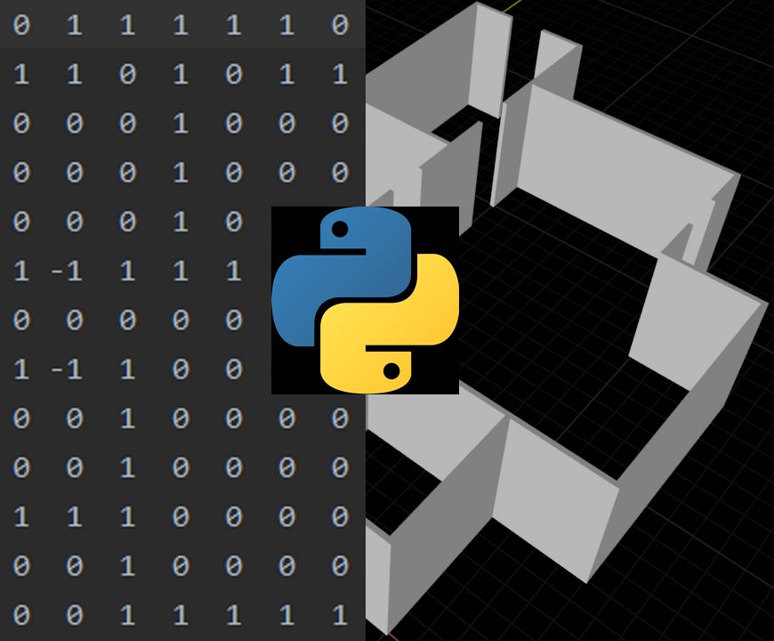

# bpy_gen_structure
Generate a 3-D structure model using Blender as a Python module and export the model in a Blender file.

## 1 Specify the desired structure
`-f` or `--floorplan` accepts a text file path containing the structure floor plan specification. The script doesn't case 
about the file ending as long as is text readable. The specification has the format of a 2-D matrix depicting the 
structure floor plan. Only single level structures are supported.

The elements of the matrix denote: 
 * the _start_ of wall panels `1`
 * the _restart_ of a wall panels `-1`
 * the _absence_ of wall panels `0`. 
 
A wall are constructed by assembling panels:
 * A wall panel requires at least two matrix element points, the first can be either a _start_ or _restart_ and the next 
 must be a _start_. 
 * If a _start_ follows, then the wall is extended by another panel in any of the orthogonal directions (up,down,left,
 right). 
 * If an _absence_ or a _restart_ follows, then no wall panel is added and the wall ends.

Look at the following examples and try to imagine walls between the `1 1` or `-1 1` and wall gaps between `1 -1`. All
 `0` are empty space.
 
Example 1: A walled garden with a single entrance.
```text
1  1  1  1  1
1  0  0  0  1
1  1  0  1  1
```
Example 2: A square room with a single entrance.
```text
1  1  1  1
1  0  0  1
1  1 -1  1
```
Example 3: A walled garden with a studio house in the middle left and a garage at the top right side.
```text
1  1  1  1  1  1  1  1  1  1
1  0  0  0  0  0  0  1  0  1
1  0  1  1  1  1  0  1  0  1
1  0  1  0  0  1  0  1  0  1
1  0  1  1 -1  1  0  0  0  1
1  0  0  0  0  0  0  0  0  1
1  1  1  1  1  1  1  1  0  1
```

## 2 Choose the building primitives
`-p` or `--panel` accepts a glTF model file path and trusts the model to be a panel with dimensions of `x:1`, `y:10`, `z:30`.

## 3 Choose Blender model output directory
`-s` or `--save` accepts a Blender file path to write the generated 3-D structure model.

## 4 Run the script
Run the generator with blender in background mode:
```shell script
  blender --background --factory-startup \
  --python $HOME/bpy_gen_structure.py -- \
  --floorplan=$specs/room.dat \
  --panel=$primitives/panel.glb \
  --save=$models/room.blend
```
or run the generator using Blender as a Python module:
```shell script
  python $HOME/bpy_gen_structure.py \
  --floorplan=$specs/room.dat \
  --panel=$primitives/panel.glb \
  --save=$models/room.blend
```
Notice:
 
 * `--factory-startup` is used to avoid the user default settings from interfering with automated scene generation.
 * `--` causes blender to ignore all following arguments so python can use them.
 * Using Blender as a Python module requires to build Blender from source and install `bpy` python module in the current
   python environment, see [official guide](https://wiki.blender.org/wiki/Building_Blender/Other/BlenderAsPyModule).

 See `blender --help` for details.
 